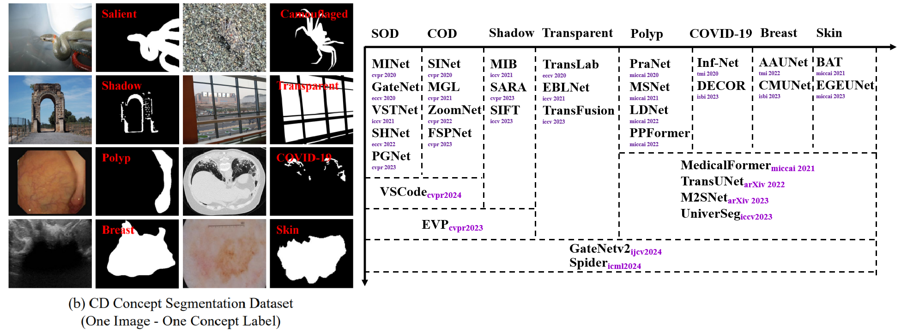
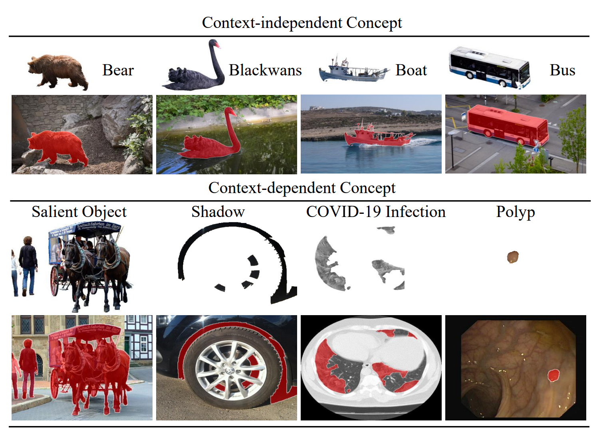
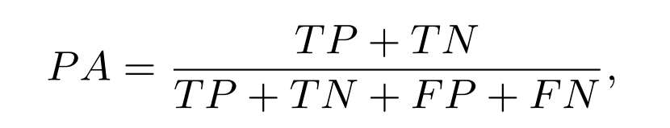
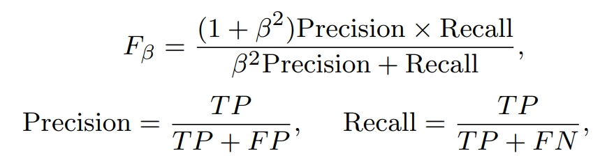
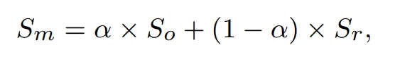
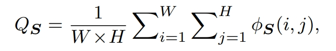
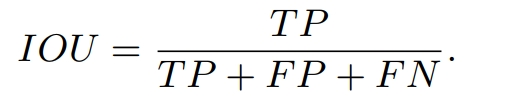
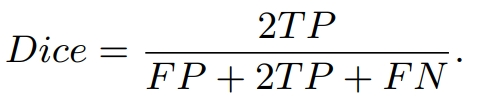
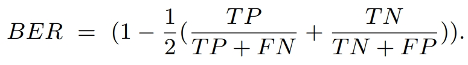
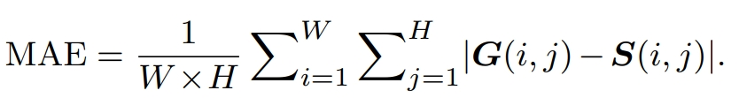

# Awesome-UniCDSeg-Segmentation

      

# 
`Awesome List for Unified Context-dependent Concept Segmentation (UniCDSeg)`

This awesome list is under construction. If you have anything to recommend or any suggestions, please feel free to contact us via e-mail (zxq@mail.dlut.edu.cn) or directly push a PR. 

< **Last updated: 30/05/2024** >

##  1. Content

- [Awesome-UniCDSeg-Segmentation](#awesome-unicdseg-segmentation)
- [`Awesome List for Unified Context-dependent Concept Segmentation (UniCDSeg)`](#awesome-list-for-unified-context-dependent-concept-segmentation-unicdseg)
  - [1. Content](#1-content)
  - [2. CI Concept vs. CD Concept](#2-ci-concept-vs-cd-concept)
    - [Definition of CI and CD Concepts](#definition-of-ci-and-cd-concepts)
    - [Current Status of Development of CI and CD Concept Segmentation](#current-status-of-development-of-ci-and-cd-concept-segmentation)
  - [3. Diverse CD Concept Datasets (Commonly used in evaluation)](#3-diverse-cd-concept-datasets-commonly-used-in-evaluation)
  - [4.  Evaluation Metrics](#4--evaluation-metrics)
  - [5. Paper List](#5-paper-list)
    - [5.1. Survey](#51-survey)
    - [5.2. Methods](#52-methods)

		
##  2. CI Concept vs. CD Concept

      

### Definition of CI and CD Concepts  
-  In philosophy and cognitive science, concepts usually contain the context-independent (CI) and context-dependent (CD) concepts, as described by the psychologist and cognitive scientist [Barsalou](https://core.ac.uk/download/pdf/205745705.pdf).
- The most important difference between context-dependent (CD) and context-independent (CI) concepts is whether the background environment (spatial context) plays a decisive role in the definition of the concept. The CD concepts mean that the target is not cognizable without its background environment. But, the context-independent (CI) concepts still have its clear definition even without a background environment.
- The CI concept such as bear and bus can be well understood by relying only on the foreground. While the CD concept is the complete opposite, salient and shadow objects require a specific background to highlight the expression of saliency and shadow concepts. Similarly, it is impossible to determine whether the lesions are polyp or COVID-19 infection without background information. Just because of this property, we need to ensure the semantic certainty of visual prompts when unifying modeling.
### Current Status of Development of CI and CD Concept Segmentation
- For the CI concept segmentation field (that is, semantic segmentation), popular datasets have multiple concept annotations for a single image. The trained CI models can well distinguish different concepts in a unified model.
- For the CD concept segmentation field, existing works explore the in-domain modeling, resulting in repetitive structure design, inefficient data utilization, and limited multi-domain generalization. And, the CI concept unified models cannot well solve the CD concept tasks.

## 3. Diverse CD Concept Datasets (Commonly used in evaluation)
| **Dataset Name** | CD Concept Type|**Year** | **Publication** | **Links** |
| :------: | :------: | :------:| :-------: | :---------|
[DUTS](https://openaccess.thecvf.com/content_cvpr_2017/papers/Wang_Learning_to_Detect_CVPR_2017_paper.pdf) |Salient Object Segmentation| 2017 | CVPR | [Paper](https://openaccess.thecvf.com/content_cvpr_2017/papers/Wang_Learning_to_Detect_CVPR_2017_paper.pdf) |
[DUT-OMRON](https://openaccess.thecvf.com/content_cvpr_2013/papers/Yang_Saliency_Detection_via_2013_CVPR_paper.pdf) |Salient Object Segmentation| 2013 |CVPR| [Paper](https://openaccess.thecvf.com/content_cvpr_2013/papers/Yang_Saliency_Detection_via_2013_CVPR_paper.pdf) |
[PASCAL-S](https://arxiv.org/pdf/1406.2807) |Salient Object Segmentation| 2014 | CVPR | [Paper](https://arxiv.org/pdf/1406.2807) |
[HKU-IS](https://openaccess.thecvf.com/content_cvpr_2015/papers/Li_Visual_Saliency_Based_2015_CVPR_paper.pdf) |Salient Object Segmentation| 2015 | CVPR | [Paper](https://openaccess.thecvf.com/content_cvpr_2015/papers/Li_Visual_Saliency_Based_2015_CVPR_paper.pdf) |
[ECSSD](https://openaccess.thecvf.com/content_cvpr_2013/papers/Yan_Hierarchical_Saliency_Detection_2013_CVPR_paper.pdf) |Salient Object Segmentation| 2015 |CVPR| [Paper](https://openaccess.thecvf.com/content_cvpr_2013/papers/Yan_Hierarchical_Saliency_Detection_2013_CVPR_paper.pdf)|
[CHAMELEON](https://www.polsl.pl/rau6/chameleon-database-animal-camouflage-analysis/) |Camouflaged Object Segmentation | 2018 | - | [Paper](https://www.polsl.pl/rau6/chameleon-database-animal-camouflage-analysis/) |
[CAMO](https://arxiv.org/pdf/2105.09451) |Camouflaged Object Segmentation| 2019 |CVIU| [Paper](https://arxiv.org/pdf/2105.09451) |
[COD10K](https://openaccess.thecvf.com/content_CVPR_2020/papers/Fan_Camouflaged_Object_Detection_CVPR_2020_paper.pdf) |Camouflaged Object Segmentation| 2020 | CVPR | [Paper](https://openaccess.thecvf.com/content_CVPR_2020/papers/Fan_Camouflaged_Object_Detection_CVPR_2020_paper.pdf) |
[NC4K](https://openaccess.thecvf.com/content/CVPR2021/papers/Lv_Simultaneously_Localize_Segment_and_Rank_the_Camouflaged_Objects_CVPR_2021_paper.pdf) |Camouflaged Object  Segmentation| 2021 | CVPR | [Paper](https://openaccess.thecvf.com/content/CVPR2021/papers/Lv_Simultaneously_Localize_Segment_and_Rank_the_Camouflaged_Objects_CVPR_2021_paper.pdf) |
[UCF](https://ieeexplore.ieee.org/document/5540209) |Shadow Segmentation| 2010 |CVPR| [Paper](https://ieeexplore.ieee.org/document/5540209) |
[ISTD](https://openaccess.thecvf.com/content_cvpr_2018/papers/Wang_Stacked_Conditional_Generative_CVPR_2018_paper.pdf) |Shadow Segmentation| 2018 | CVPR | [Paper](https://openaccess.thecvf.com/content_cvpr_2018/papers/Wang_Stacked_Conditional_Generative_CVPR_2018_paper.pdf) |
[SBU](https://link.springer.com/chapter/10.1007/978-3-319-46466-4_49) |Shadow Segmentation| 2016 | ECCV | [Paper](https://link.springer.com/chapter/10.1007/978-3-319-46466-4_49) |
[Trans10K](https://www.ecva.net/papers/eccv_2020/papers_ECCV/papers/123580681.pdf) |Transparent Object Segmentation| 2020 | ECCV | [Paper](https://www.ecva.net/papers/eccv_2020/papers_ECCV/papers/123580681.pdf) |
[Trans10Kv2](https://arxiv.org/pdf/2101.08461) |Transparent Object Segmentation| 2021 | IJCAI | [Paper](https://arxiv.org/pdf/2101.08461) |
[ETIS-LaribPolypDB](https://link.springer.com/article/10.1007/s11548-013-0926-3) |Colonoscopy Polyp Segmentation| 2014 | IJCARS | [Paper](https://link.springer.com/article/10.1007/s11548-013-0926-3) |
[CVC-ColonDB](https://xueliancheng.github.io/SLT-Net-project/) |Colonoscopy Polyp Segmentation| 2015 | TMI | [Paper](https://link.springer.com/article/10.1007/s11548-013-0926-3) |
[CVC-ClinicDB](https://polyp.grand-challenge.org/CVCClinicDB/) |Colonoscopy Polyp Segmentation| 2015 | CMIG | [Paper](https://www.sciencedirect.com/science/article/pii/S0895611115000567) |
[Kvasir](https://datasets.simula.no/kvasir/) |Colonoscopy Polyp Segmentation| 2017 | ACM MMSys | [Paper](https://dl.acm.org/doi/abs/10.1145/3083187.3083212) |
[CVC-300](https://github.com/jbernoz/deeppolyp) |Colonoscopy Polyp Segmentation| 2017 |JHE | [Paper](https://www.hindawi.com/journals/jhe/2017/4037190/)|
[COVID-19 data](https://ieeexplore.ieee.org/stamp/stamp.jsp?arnumber=9098956) |COVID-19 Lung Infection| 2020 |TMI | [Paper](https://ieeexplore.ieee.org/stamp/stamp.jsp?arnumber=9098956)|
[BUSI](https://www.sciencedirect.com/science/article/pii/S2352340919312181) |Breast Lesion Segmentation| 2020 |Data in Brief | [Paper](https://www.sciencedirect.com/science/article/pii/S2352340919312181)|
[ISIC17-20](https://challenge.isic-archive.com/data/) |Skin Lesion Segmentation| 2017-2020 | -| [Website](https://challenge.isic-archive.com/data/)|

##  4.  Evaluation Metrics
[PySegMetrics (PSM): A Python-based Simple yet Efficient Evaluation Toolbox for Segmentation-like tasks](https://github.com/Xiaoqi-Zhao-DLUT/PySegMetric_EvalToolkit)

- **Pixel Accuracy (PA)** is calculated based on
the binarized prediction mask and ground-truth:

      

- **F-measure** is a metric that comprehensively considers both precision and recall:

      

- **weighted F-measure** is proposed to improve the metric F-measure. It assigns different weights (ω) to precision and recall across different errors at different locations, considering the neighborhood information:

      

- **S-measure** evaluates the spatial structure similarity by combining the region-aware
structural similarity Sr and the object-aware structural similarity So:

      

- **E-measure**  can jointly capture image level statistics and local pixel matching information:

      

- **IOU** is the most common metric for evaluating classification accuracy:

      

- **Dice** is a statistic used to gauge the similarity of two samples and become the most used metric in validating medical image segmentation:

      

- **Balanced error rate (BER)** is a common metric to evaluate shadow detection performance, where shadow and non-shadow regions contribute equally to the overall performance without considering their relative areas:

      

- **MAE** measures the average absolute difference between the prediction and the ground truth pixel by pixel:

      

##  5. Paper List
###  5.1. Survey
| **Year** | **Model** | **Publication** | **Title**                                 |  **Links**                                                    |
| :------: | :------: |:------: | :----------------------------------------------------------- |  :----------------------------------------------------------- |
| 2024 | GateNetv2 | IJCV |Towards Diverse Binary Segmentation via A Simple yet General Gated Network  Xiaoqi Zhao; Youwei Pang; Lihe Zhang; Huchuan Lu; Lei Zhang | [Paper](https://arxiv.org/pdf/2303.10396)/[Code](https://github.com/Xiaoqi-Zhao-DLUT/GateNet-RGB-Saliency)
###  5.2. Methods
| **Year** | **Model** | **Publication** | **Title**                                 |  **Links**                                                    |
| :------: | :------: |:------: | :----------------------------------------------------------- |  :----------------------------------------------------------- |
| 2024 | Universal Model | MIA | Universal and Extensible Language-Vision Models for Organ Segmentation and Tumor Detection from Abdominal Computed Tomography Jie Liu, Yixiao Zhang, Kang Wang, Mehmet Can Yavuz, Xiaoxi Chen, Yixuan Yuan, Haoliang Li, Yang Yang, Alan Yuille, Yucheng Tang, Zongwei Zhou  | [Paper](https://arxiv.org/pdf/2405.18356)/[Code](https://github.com/ljwztc/CLIP-Driven-Universal-Model)
| 2024 | Spider | ICML | Spider : A Unified Framework for Context-dependent Concept Segmentation Xiaoqi Zhao; Youwei Pang; Wei Ji; Baicheng Sheng; Jiaming Zuo; Lihe Zhang; Huchuan Lu  | [Paper](https://arxiv.org/pdf/2405.01002)/[Code](https://github.com/Xiaoqi-Zhao-DLUT/Spider-UniCDSeg)
| 2024 | GateNetv2 | IJCV |Towards Diverse Binary Segmentation via A Simple yet General Gated Network  Xiaoqi Zhao; Youwei Pang; Lihe Zhang; Huchuan Lu; Lei Zhang | [Paper](https://arxiv.org/pdf/2303.10396)/[Code](https://github.com/Xiaoqi-Zhao-DLUT/GateNet-RGB-Saliency)
| 2024 | VSCode | CVPR | VSCode: General Visual Salient and Camouflaged Object Detection with 2D Prompt Learning  Ziyang Luo; Nian Liu; Wangbo Zhao; Xuguang Yang; Dingwen Zhang; Deng-Ping Fan; Fahad Khan; Junwei Han | [Paper](https://arxiv.org/pdf/2311.15011)/[Code](https://github.com/Sssssuperior/VSCode)
| 2023 | SegGPT | ICCV | SegGPT: Towards Segmenting Everything in Context  Xinlong Wang;  Xiaosong Zhang; Yue Cao; Wen Wang; Chunhua Shen; Tiejun Huang | [Paper](https://openaccess.thecvf.com/content/ICCV2023/papers/Wang_SegGPT_Towards_Segmenting_Everything_in_Context_ICCV_2023_paper.pdf)/[Code](https://github.com/baaivision/Painter)
| 2023 | UniverSeg | ICCV | UniverSeg: Universal Medical Image Segmentation  Victor Ion Butoi;  Jose Javier Gonzalez Ortiz; Tianyu Ma; Mert R. Sabuncu; John Guttag; Adrian V. Dalca | [Paper](https://arxiv.org/pdf/2304.06131)/[Code](https://github.com/JJGO/UniverSeg)
| 2023 | EVP | CVPR | Explicit Visual Prompting for Low-Level Structure Segmentations  Weihuang Liu; Xi Shen; Chi-Man Pun; Xiaodong Cun | [Paper](https://arxiv.org/pdf/2303.10883)/[Code](https://github.com/NiFangBaAGe/Explicit-Visual-Prompt)
| 2023 | M2SNet | arXiv | M2SNet: Multi-scale in Multi-scale Subtraction Network for Medical Image Segmentation  Xiaoqi Zhao; Hongpeng Jia; Youwei Pangl; Long Lv; Feng Tian; Lihe Zhang; Weibing Sun; Huchuan Lu | [Paper](https://arxiv.org/pdf/2303.10894)/[Code](https://github.com/Xiaoqi-Zhao-DLUT/MSNet-M2SNet)

